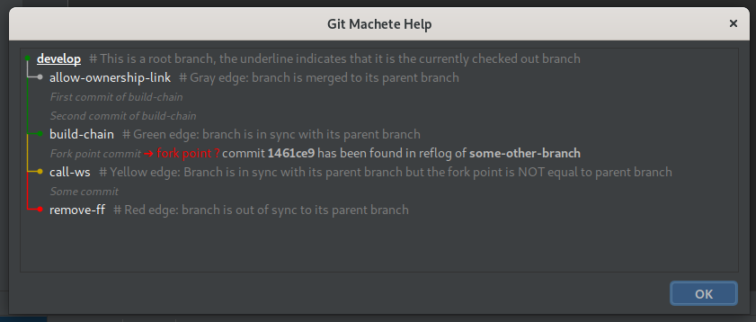
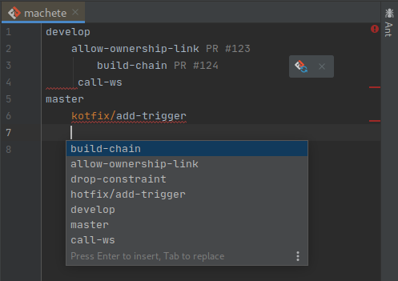
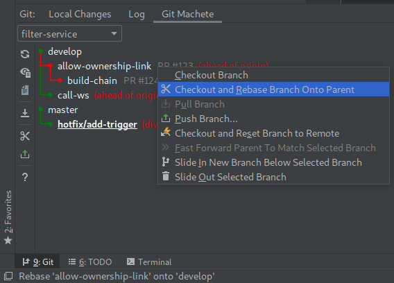

## Take a look at your repository from a new perspective with Git Machete Plugin!

Git and IntelliJ-based software is currently one of the most important tools in software development.
The version control system provided with the IDE allows the undertaking of numerous necessary actions. 
Despite the many benefits of the provided IDE and VCS integration, 
the state of more extensive repositories often gets difficult to interpret and non-intuitive.

In view of these inconveniences, a company [VirtusLab](https://virtuslab.com/) created a plugin  — 
**a git repository organizer, and a rebase automation tool, named Git Machete.**

It allows looking at the state of the repository from a previously inexperienceable perspective.
It puts the primary focus on branches (rather than commits), their relationship to each other, 
and their relationship to the remote repository. 
Moreover, it provides both diagnostic and corrective functionalities 
for the shape of the repository and the relationships mentioned. 
It finds an exceptional application in maintaining the linear history of the Git. 

### Git Machete Status Graph

The picture above presents the demo repository _filter-service_ with a few branches.
It contains two **root branches**: _develop_ and _master_. 
The first of them has two **child branches**: _allow-ownership-link_ 
(with another child branch - _build-chain_), and _call-ws_.

A line holds a part of the whole graph (the description of colors comes with the next picture),
a name of a branch, an optional custom annotation, and relation to the remote branch. 

Without going into details, the green edge indicates the desired state -
the first commit of a child branch is the direct descendant of the parent's last commit.

---
_In general, Git Machete is a tool that helps manage multiple branches within a git repository 
and thus promotes the creation of smaller pull requests that are (usually) easier to review._

### Machete File

The branches presented within the graph are being defined by a special configuration file (`.git/machete`).

The file can be easily opened from the plugin's toolbar.
It supports both syntax highlight and local branch names completion.
The file listens to changes to itself and allows to refresh the table.

### Lights, Camera... Actions

The plugin provides a bunch of actions that can help you to manage your repository.

Among the others, there is `Rebase branch onto parent` 
that performs interactive rebase of a given branch onto its parent, `Push` and `Pull`.

### Try it now

The plugin is available from the [Marketplace](https://plugins.jetbrains.com/plugin/14221-git-machete "Jet Brains Marketplace - Git Machete Plugin").
For additional references see the GitHub [page](https://github.com/VirtusLab/git-machete-intellij-plugin "GitHub - Git Machete") too. 

---
_If you work with a git rebase flow, Git Machete will (vastly!) help you manage 
the jungle of branches stacking on top of each other when you're, 
for example, working on a couple of different PRs in parallel._
