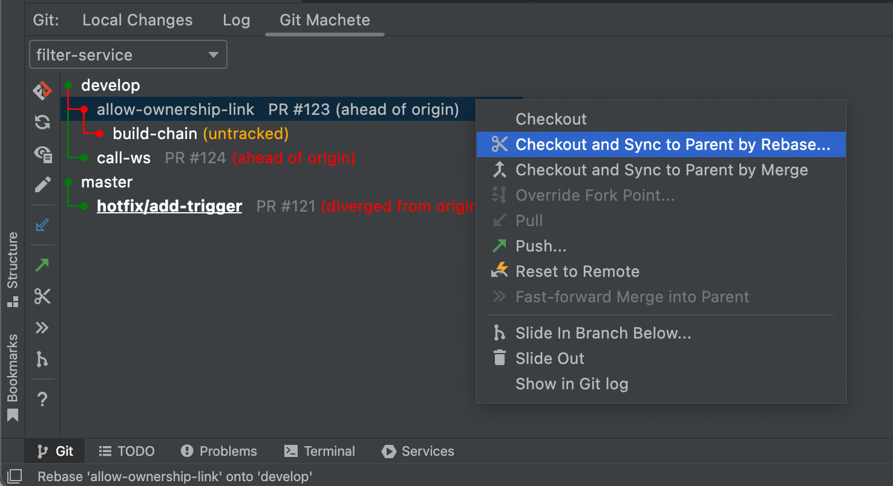
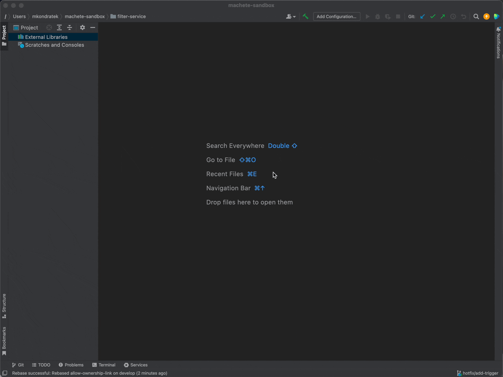

## Take a look at your repository from a new perspective with Git Machete Plugin!

Git and IntelliJ-based software are currently one of the most important tools in software development.
The version control system provided with the JetBrains's IDE products
allows performing pretty much all everyday VCS actions directly via the IDE.
Among the many useful benefits of the provided IDE and VCS integration,
the full support of GitHub Pull Requests introduced in IDEA 2020.2 must be emphasized.

We created a plugin that eases the management of 2+ branches in the repository
while also promoting creation of small PRs &mdash;
**a git repository organizer, and a rebase/merge/push/pull automation tool, named Git Machete.**

It allows for looking at the state of the repository from a previously inexperienceable perspective.
It puts the primary focus on branches (rather than commits),
their relationship to each other and also to the remote repository.
Moreover, it gives both diagnostic and restorative functionalities
for the shape of the repository and the mentioned relationships.
It finds an outstanding application in maintaining linear Git history.

## Git Machete

The Git Machete plugin is a tool that helps developers handle multiple branches.
The main features of the plugin are:
- helps keep branches up to date even if (side effects of small PRs):
  - there many of them
  - they're occasionally stacked on one another
- promotes linear history but without strictly enforcing it in every case
- gives a bird's eye view of the repo
- automates common flows...

#### Git Machete Status Graph

The picture above presents the demo repository _filter-service_ with a few branches.
It contains two **root branches**: _develop_ and _master_.
The first of them has two **child branches**: _allow-ownership-link_
(with another child branch &mdash; _build-chain_), and _call-ws_.

Each line contains a name of a branch, an optional custom annotation, and relation to the remote branch.

Without going into details, the **green edge** indicates the desired state &mdash;
the tip of the child branch is a direct descendant of the parent branch tip
(i.e. all commits reachable from the parent are also reachable from the child). 
On the other hand, the **red edge** tells us the opposite &mdash;
the tip of the child branch is **not** a direct descendant of the parent branch tip.

In most cases, an edge becomes red after committing some changes to the parent branch (review fixes)
or pulling new commits to the parent from a remote.

#### Machete File

The branches presented within the graph are defined in a very simple configuration file (`.git/machete`),
which can be easily opened from the plugin's toolbar.
It supports both syntax highlighting and completion of local branch names.
The graph is automatically refreshed when `.git/machete` is modified.

Bear in mind that there is no need to edit the machete file manually to set up your branch layout tree.
Feel free to use `Discover Branch Layout` functionality that will find it out for you automatically.
It can be performed from `Help -> Find Action...` (default shortcut: `Ctrl + Shift + A`).
Furthermore, the discover happens in the case of a missing or empty machete file
(although the discovered layout might require some manual changes).

#### Lights, Camera... Actions

The plugin provides a bunch of actions that can help you to manage your repository.

Among the others, there is `Rebase onto Parent`
(that performs interactive rebase of a given branch onto its parent), `Push` and `Pull`.
Let's have a look at the following example...

Branch `allow-ownership-link` is **out of sync** (red edge) to its parent &mdash; `develop`.
Furthermore, it is **ahead of** its remote branch (`origin/develop`).
With Git Machete we can quickly and conveniently lead it to a desired state.

First, `Checkout and Rebase Branch Onto Parent`.
This will perform an interactive rebase from IntelliJ.
Once the rebase is finished, the branch is **in sync** (green edge) with its parent.

##### VCS Log Rebase

##### Git Machete Rebase

Now all that's left is to `Push...`.
This action opens a (force) push dialog.  
After a successful push, the remote branch is **up to date** with its remote branch.

The final repository status is shown below.

### Motivation

The idea standing behind the plugin is automating the developer's work.
We (developers) should strive for focusing on actual development
and spend less time organizing our work (with no loos for its results!).

To be more precise and understand the technical background
we should look closer to the consequences of big and small PRs.
**Big PRs are bad.** Reviewers are unwilling to even begin the review.
They are more likely to skip vital parts of the newly-added code.
It's hard/impossible to keep entire context in memory during review.

On the contrary, **small PRs are beneficial**.
Reviewers are more willing to begin the review.
They are less likely to skip vital parts of the newly-added code.
It's much easier to keep the entire context in memory during the review.

Creating and maintaining small, focused, easy-to-review PRs is a comfortable and desired approach
for both the authors and, especially, the reviewers.
This is exactly what Git Machete is promoting.

### The future of Git Machete

Git Machete plugin is being developed and maintained continuously.
We are doing our best to provide new features and quickly react to the users' feedback.
We are responding to the new issues and ideas.

The feature that we are definitely aiming for now is the traverse functionality
which would allow you to interactively go through the whole branch layout tree
and apply necessary actions (rebases, pushes, etc.) in order to get every branch in syncs.

### Learn more

The plugin is available from the [Marketplace](https://plugins.jetbrains.com/plugin/14221-git-machete "Jet Brains Marketplace - Git Machete Plugin").
It may differ a bit from presented version as some improvements may had been provided with the newest release.

For additional reference, visit the project on [GitHub](https://github.com/VirtusLab/git-machete-intellij-plugin#git-machete-intellij-plugin "GitHub - Git Machete Plugin").
Feel free to open new issues (both bug reports and feature requests are welcome).
