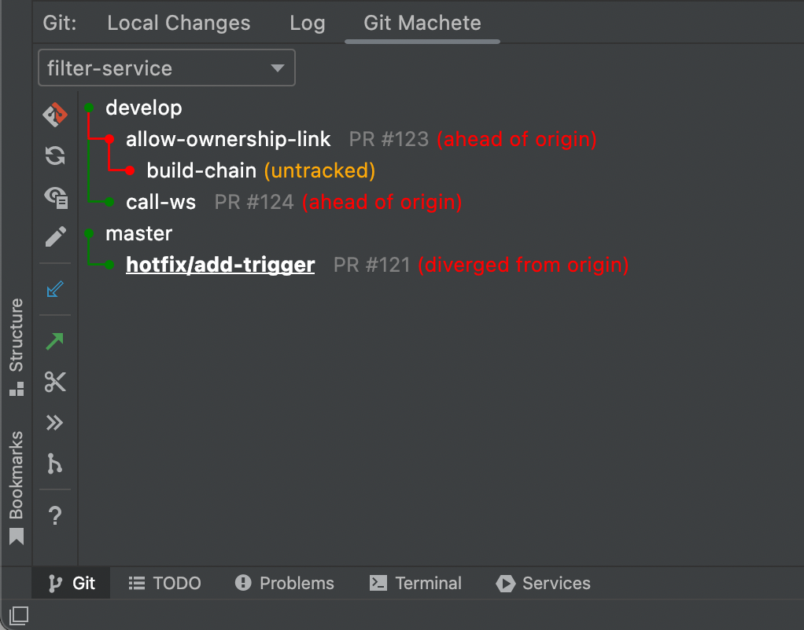
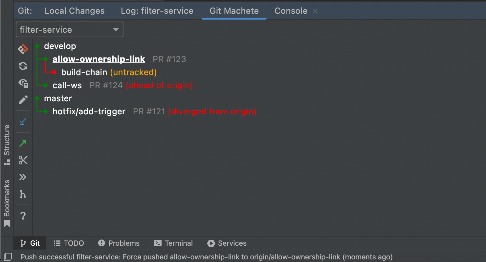

## Take a look at your repository from a new perspective with Git Machete Plugin!

Git and IntelliJ-based software is currently one of the most important tools in software development.
The version control system provided with the IDE allows the undertaking of numerous necessary actions. 
Among the many useful benefits of the provided IDE and VCS integration,
the newest (introduced with IDEA 2020.2) full support of GitHub Pull Requests must be mentioned.

It is natural that the state of more extensive repositories often gets non-intuitive and difficult to interpret over time.
Given these inconveniences, [VirtusLab](https://virtuslab.com/) created a plugin  — 
**a git repository organizer, and a rebase automation tool, named Git Machete.**

It allows looking at the state of the repository from a previously inexperienceable perspective.
It puts the primary focus on branches (rather than commits), their relationship to each other, 
and their relationship to the remote repository. 
Moreover, it provides both diagnostic and corrective functionalities 
for the shape of the repository and the relationships mentioned. 
It finds an exceptional application in maintaining linear Git history.

---
_In general, Git Machete is a tool that helps manage multiple branches within a git repository 
and thus promotes the creation of smaller & more focused pull requests that are easier to review._

### Git Machete Status Graph

The picture above presents the demo repository _filter-service_ with a few branches.
It contains two **root branches**: _develop_ and _master_. 
The first of them has two **child branches**: _allow-ownership-link_ 
(with another child branch - _build-chain_), and _call-ws_.

A line holds a part of the whole graph (the description of colors comes with the next picture),
a name of a branch, an optional custom annotation, and relation to the remote branch. 

Without going into details, the **green edge** indicates the desired state -
the first commit of a child branch is the direct descendant of the parent's last commit.
On the other hand, the **red edge** tells us the opposite -
the first commit of a child branch is NOT the direct descendant of the parent's last commit.

In most cases, an edge gets red after committing some changes to the parent branch (review fixes)
or pulling changes from remote.

### Machete File

The branches presented within the graph are defined in a very simple configuration file (`.git/machete`).

The file can be easily opened from the plugin's toolbar.
It supports both syntax highlight and local branch names completion.
The graph is automatically refreshed when `.git/machete` is modified.

### Lights, Camera... Actions

The plugin provides a bunch of actions that can help you to manage your repository.

Among the others, there is `Rebase branch onto parent` 
that performs interactive rebase of a given branch onto its parent, `Push` and `Pull`.
Let's have a look at the following example...

Branch `allow-ownership-link` is **out of sync** (red edge) to its parent - `develop`.
Furthermore, it is **ahead of** its remote branch.
With Git Machete we can quickly and comfortably lead it to a more natural state. 

First, `Checkout and Rebase Branch Onto Parent`.
This will perform a well-known interactive rebase from IntelliJ.
Once the rebase is finished the branch is now **in sync** (green edge) with its parent.

| VCS Log Rebase | Git Machete Rebase |
| --- | --- |
|  |   |

Second, `Push Branch...`. 
This action opens a usual push dialog.
After a successful push, the remote branch is **up to date** with its remote branch.

The final repository status is shown below.

### Try it now

The plugin is available from the [Marketplace](https://plugins.jetbrains.com/plugin/14221-git-machete "Jet Brains Marketplace - Git Machete Plugin").
For additional references see the project on [GitHub](https://github.com/VirtusLab/git-machete-intellij-plugin#git-machete-intellij-plugin "GitHub - Git Machete").

---
_If you work with a git rebase flow, Git Machete will (vastly!) help you manage 
the jungle of branches stacking on top of each other when you're, 
for example, working on a couple of different PRs in parallel._
